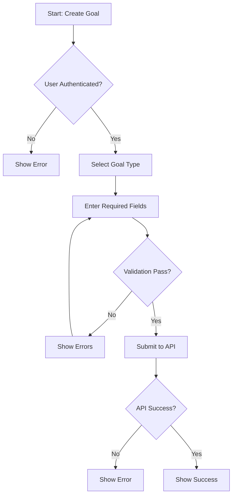

# Goal Tracking System - Decision Trees and Flow Charts

This document contains decision trees and flow charts for key decision points and processes in the Goals Tracking Management System.

---

## 1. Goal Creation Decision Tree

```
START: User wants to create a goal
│
├─> Is user authenticated?
│   ├─ NO → Show login/error message → END
│   └─ YES → Continue
│
├─> User selects goal type
│   ├─ QUANTITATIVE
│   │   ├─> Enter: title, description, category, priority
│   │   ├─> Enter: startValue, targetValue, currentValue, unit
│   │   ├─> Set: allowDecimals (yes/no)
│   │   ├─> Optional: minValue, maxValue, startDate, deadline
│   │   └─> Validate numeric values → Submit
│   │
│   ├─ QUALITATIVE
│   │   ├─> Enter: title, description, category, priority
│   │   ├─> Set: qualitativeStatus (default: not_started)
│   │   ├─> Optional: improvementCriteria, targetRating, startDate, deadline
│   │   └─> Submit
│   │
│   ├─ BINARY
│   │   ├─> Enter: title, description, category, priority
│   │   ├─> Optional: targetCount, items array
│   │   ├─> Set: allowPartialCompletion (yes/no)
│   │   ├─> Optional: startDate, deadline
│   │   └─> Submit
│   │
│   ├─ MILESTONE
│   │   ├─> Enter: title, description, category, priority
│   │   ├─> Add at least one milestone
│   │   │   ├─> For each milestone: title, order, optional description, dueDate, dependencies
│   │   │   └─> Validate no circular dependencies
│   │   ├─> Set: allowMilestoneReordering, requireSequentialCompletion
│   │   ├─> Optional: startDate, deadline
│   │   └─> Submit
│   │
│   ├─ RECURRING
│   │   ├─> Enter: title, description, category, priority
│   │   ├─> Configure recurrence:
│   │   │   ├─> frequency: daily/weekly/monthly/yearly
│   │   │   ├─> interval: positive integer
│   │   │   ├─> If weekly: daysOfWeek array
│   │   │   ├─> If monthly: dayOfMonth (optional)
│   │   │   ├─> If yearly: dayOfYear (optional)
│   │   │   └─> Optional: endDate
│   │   ├─> Optional: startDate, deadline
│   │   └─> Submit
│   │
│   └─ HABIT
│       ├─> Enter: title, description, category, priority
│       ├─> Set: targetFrequency (daily/every_other_day/weekly/custom)
│       ├─> If custom: set customFrequency
│       ├─> Optional: startDate, deadline
│       └─> Submit
│
├─> Validate all required fields
│   ├─ Validation fails → Show errors → User fixes → Retry validation
│   └─ Validation passes → Continue
│
├─> Submit to API
│   ├─ API error → Show error message → User can retry or cancel
│   └─ API success → Show success message → Navigate to goal detail
│
END: Goal created successfully
```

---

## 2. Progress Update Decision Tree

```
START: User wants to update goal progress
│
├─> Load goal data
│   ├─ Error loading → Show error → END
│   └─ Success → Continue
│
├─> Determine goal type
│   │
│   ├─ QUANTITATIVE
│   │   ├─> User enters new currentValue
│   │   ├─> Validate: within minValue/maxValue (if set)
│   │   ├─> Validate: matches allowDecimals setting
│   │   ├─> Calculate progress: ((current - start) / (target - start)) * 100
│   │   ├─> Clamp progress: 0-100 (or allow >100 if configured)
│   │   ├─> Check: currentValue >= targetValue?
│   │   │   ├─ YES → Suggest marking goal as completed
│   │   │   └─ NO → Continue
│   │   ├─> Create progress history entry
│   │   └─> Save update
│   │
│   ├─ QUALITATIVE
│   │   ├─> User updates qualitativeStatus OR adds self-assessment
│   │   ├─> If status update:
│   │   │   ├─ not_started → progress = 0%
│   │   │   ├─ in_progress → progress = 50% (or based on ratings)
│   │   │   └─ completed → progress = 100%
│   │   ├─> If self-assessment:
│   │   │   ├─> Calculate average rating
│   │   │   └─> Update progress: (averageRating / 10) * 100
│   │   ├─> Create progress history entry
│   │   └─> Save update
│   │
│   ├─ BINARY
│   │   ├─> User checks/unchecks items OR updates currentCount
│   │   ├─> Update currentCount
│   │   ├─> Calculate progress:
│   │   │   ├─ If targetCount set: (currentCount / targetCount) * 100
│   │   │   └─ If no targetCount: 100% if currentCount > 0, else 0%
│   │   ├─> Check: currentCount >= targetCount?
│   │   │   ├─ YES → Suggest marking goal as completed
│   │   │   └─ NO → Continue
│   │   ├─> Create progress history entry
│   │   └─> Save update
│   │
│   ├─ MILESTONE
│   │   ├─> User marks milestone as completed
│   │   ├─> Check: dependencies met?
│   │   │   ├─ NO → Show error: "Complete dependencies first" → END
│   │   │   └─ YES → Continue
│   │   ├─> Check: sequential completion required?
│   │   │   ├─ YES → Check: previous milestone completed?
│   │   │   │   ├─ NO → Show error: "Complete milestones in order" → END
│   │   │   │   └─ YES → Continue
│   │   │   └─ NO → Continue
│   │   ├─> Update milestone status to 'completed'
│   │   ├─> Set milestone completedDate
│   │   ├─> Calculate overall progress: (completedMilestones / totalMilestones) * 100
│   │   ├─> Check: all milestones completed?
│   │   │   ├─ YES → Suggest marking goal as completed
│   │   │   └─ NO → Continue
│   │   ├─> Create progress history entry
│   │   └─> Save update
│   │
│   ├─ RECURRING
│   │   ├─> User marks occurrence as completed
│   │   ├─> Create HabitEntry with completed: true
│   │   ├─> Update completionStats:
│   │   │   ├─ Increment completedOccurrences
│   │   │   ├─ Recalculate completionRate
│   │   │   └─ Update streak
│   │   ├─> Calculate progress: (completedOccurrences / totalOccurrences) * 100
│   │   ├─> Create progress history entry
│   │   └─> Save update
│   │
│   └─ HABIT
│       ├─> User marks habit for today as completed
│       ├─> Create HabitEntry with completed: true, date: today
│       ├─> Update completionStats:
│       │   ├─ Increment completedOccurrences
│       │   ├─ Recalculate completionRate
│       │   └─ Update streak
│       ├─> Calculate habitStrength (based on consistency, streak, etc.)
│       ├─> Calculate progress: (completedDays / totalDaysInPeriod) * 100
│       ├─> Create progress history entry
│       └─> Save update
│
├─> Save update to API
│   ├─ API error → Show error → Rollback optimistic update → END
│   └─ API success → Update UI → Show success message
│
END: Progress updated successfully
```

---

## 3. Goal Completion Decision Tree

```
START: User wants to mark goal as completed
│
├─> Load goal data
│
├─> Check current progress
│   ├─ progress < 100% → Show warning: "Progress is not 100%. Mark complete anyway?"
│   │   ├─ User cancels → END
│   │   └─ User confirms → Continue
│   └─ progress = 100% → Continue
│
├─> Determine goal type
│   │
│   ├─ QUANTITATIVE
│   │   ├─> Check: currentValue >= targetValue?
│   │   │   ├─ NO → Show warning → User confirms → Continue
│   │   │   └─ YES → Continue
│   │
│   ├─ BINARY
│   │   ├─> Check: currentCount >= targetCount (if set)?
│   │   │   ├─ NO → Show warning → User confirms → Continue
│   │   │   └─ YES → Continue
│   │
│   ├─ MILESTONE
│   │   ├─> Check: all milestones completed?
│   │   │   ├─ NO → Show warning: "Not all milestones completed" → User confirms → Continue
│   │   │   └─ YES → Continue
│   │
│   ├─ RECURRING
│   │   ├─> Show message: "This will mark the current occurrence as complete. The goal will remain active."
│   │   └─> User confirms → Mark occurrence complete → END (goal stays active)
│   │
│   └─ HABIT
│       ├─> Show message: "This will mark today's habit as complete. The goal will remain active."
│       └─> User confirms → Mark today complete → END (goal stays active)
│
├─> Update goal status to 'completed'
├─> Set completedDate to current date/time
├─> Set progress to 100% (if not already)
├─> Update updatedAt timestamp
│
├─> Optional: Show completion celebration
├─> Optional: Prompt for completion note
│
├─> Save to API
│   ├─ API error → Show error → Rollback → END
│   └─ API success → Continue
│
├─> Update related goals (if applicable)
├─> Update statistics/analytics
│
├─> Optional: Archive goal (if configured)
│
END: Goal marked as completed
```

---

## 4. Status Transition Decision Tree

```
START: User wants to change goal status
│
├─> Get current status
│
├─> Determine target status
│   │
│   ├─ Target: PAUSED
│   │   ├─> Current: active → ALLOWED
│   │   │   ├─> Set status to 'paused'
│   │   │   ├─> Optional: Pause deadline countdown
│   │   │   ├─> Optional: Prompt for pause reason
│   │   │   └─> Save
│   │   ├─> Current: completed → NOT ALLOWED → Show error → END
│   │   └─> Current: cancelled → NOT ALLOWED → Show error → END
│   │
│   ├─ Target: CANCELLED
│   │   ├─> Current: active → ALLOWED
│   │   │   ├─> Show confirmation dialog
│   │   │   ├─> User cancels → END
│   │   │   └─> User confirms → Continue
│   │   ├─> Current: paused → ALLOWED
│   │   │   ├─> Show confirmation dialog
│   │   │   ├─> User cancels → END
│   │   │   └─> User confirms → Continue
│   │   ├─> Current: completed → NOT ALLOWED → Show error → END
│   │   └─> Current: cancelled → Already cancelled → END
│   │   │
│   │   ├─> Set status to 'cancelled'
│   │   ├─> Optional: Prompt for cancellation reason
│   │   └─> Save
│   │
│   ├─ Target: ACTIVE
│   │   ├─> Current: paused → ALLOWED
│   │   │   ├─> Set status to 'active'
│   │   │   ├─> Resume deadline countdown (if applicable)
│   │   │   └─> Save
│   │   ├─> Current: active → Already active → END
│   │   ├─> Current: completed → NOT ALLOWED → Show error → END
│   │   └─> Current: cancelled → NOT ALLOWED → Show error → END
│   │
│   └─ Target: COMPLETED
│       ├─> Current: active → ALLOWED (if progress = 100% or user confirms)
│       │   └─> Follow "Goal Completion Decision Tree"
│       ├─> Current: paused → ALLOWED (if progress = 100% or user confirms)
│       │   └─> Follow "Goal Completion Decision Tree"
│       ├─> Current: completed → Already completed → END
│       └─> Current: cancelled → NOT ALLOWED → Show error → END
│
END: Status updated (or error shown)
```

---

## 5. Milestone Dependency Validation Flow

```
START: User adds/updates milestone with dependencies
│
├─> Get list of all milestone IDs in goal
│
├─> For each dependency ID:
│   ├─> Check: dependency ID exists in milestone list?
│   │   ├─ NO → ERROR: "Dependency references non-existent milestone" → END
│   │   └─ YES → Continue
│
├─> Check for circular dependencies
│   ├─> Build dependency graph
│   ├─> Run cycle detection algorithm (DFS)
│   │   ├─ Cycle detected → ERROR: "Circular dependencies detected" → END
│   │   └─ No cycle → Continue
│
├─> Check: milestone depends on itself?
│   ├─ YES → ERROR: "Milestone cannot depend on itself" → END
│   └─ NO → Continue
│
├─> Validation passed
│
END: Dependencies valid, save milestone
```

---

## 6. Streak Calculation Flow

```
START: Calculate streak for habit/recurring goal
│
├─> Get all entries, sorted by date (descending)
│
├─> Find last completed entry
│   ├─ No completed entries → streak = 0 → END
│   └─ Found → Continue
│
├─> Initialize: currentStreak = 0, lastDate = lastCompletedDate
│
├─> Loop backwards from lastDate:
│   ├─> Check entry for (lastDate - 1 day)
│   │   ├─ Entry exists AND completed = true
│   │   │   ├─> Increment currentStreak
│   │   │   ├─> Set lastDate = lastDate - 1 day
│   │   │   └─> Continue loop
│   │   ├─ Entry exists AND completed = false
│   │   │   ├─> Check grace period
│   │   │   │   ├─ Grace period allows → Continue loop (don't break)
│   │   │   │   └─ No grace period → BREAK (streak broken)
│   │   └─ No entry (missed day)
│   │       ├─> Check grace period
│   │       │   ├─ Grace period allows → Continue loop
│   │       │   └─ No grace period → BREAK (streak broken)
│   │
├─> Update streak:
│   ├─> current = currentStreak
│   ├─> longest = max(currentStreak, previous longest)
│   └─> lastCompletedDate = last completed entry date
│
END: Streak calculated
```

---

## 7. Recurrence Next Occurrence Calculation

```
START: Calculate next occurrence for recurring goal
│
├─> Get recurrence configuration
│
├─> Get current date/time
│
├─> Determine frequency type
│   │
│   ├─ DAILY
│   │   ├─> nextDate = today + interval days
│   │   └─> Check: nextDate <= endDate (if set)?
│   │       ├─ NO → Goal completed (no more occurrences) → END
│   │       └─ YES → Return nextDate
│   │
│   ├─ WEEKLY
│   │   ├─> Get daysOfWeek array
│   │   ├─> Find next day in daysOfWeek that is >= today
│   │   ├─> If found this week:
│   │   │   └─> nextDate = that day this week
│   │   └─> If not found this week:
│   │       └─> nextDate = first day in daysOfWeek next week
│   │   ├─> Apply interval: nextDate = nextDate + (interval - 1) weeks
│   │   └─> Check: nextDate <= endDate (if set)? → Return or mark complete
│   │
│   ├─ MONTHLY
│   │   ├─> Get dayOfMonth (or use 1st if not set)
│   │   ├─> nextDate = next occurrence of dayOfMonth
│   │   ├─> Apply interval: Add (interval - 1) months
│   │   └─> Check: nextDate <= endDate (if set)? → Return or mark complete
│   │
│   └─ YEARLY
│       ├─> Get dayOfYear (or use Jan 1 if not set)
│       ├─> nextDate = next occurrence of dayOfYear
│       ├─> Apply interval: Add (interval - 1) years
│       └─> Check: nextDate <= endDate (if set)? → Return or mark complete
│
END: Return next occurrence date (or null if goal completed)
```

---

## 8. Habit Strength Calculation Flow

```
START: Calculate habit strength for habit goal
│
├─> Get habit entries for last 30 days
│
├─> Calculate components:
│   │
│   ├─ Consistency (40% weight)
│   │   ├─> completedDays = count entries with completed = true in last 30 days
│   │   ├─> consistencyScore = (completedDays / 30) * 100
│   │   └─> weightedConsistency = consistencyScore * 0.4
│   │
│   ├─ Current Streak (30% weight)
│   │   ├─> Calculate current streak (see "Streak Calculation Flow")
│   │   ├─> streakScore = min((currentStreak / 30) * 100, 100)
│   │   └─> weightedStreak = streakScore * 0.3
│   │
│   ├─ Completion Rate (20% weight)
│   │   ├─> totalOccurrences = total entries (all time)
│   │   ├─> completedOccurrences = entries with completed = true
│   │   ├─> completionRate = (completedOccurrences / totalOccurrences) * 100
│   │   └─> weightedCompletion = completionRate * 0.2
│   │
│   └─ Recency (10% weight)
│       ├─> Get entries for last 7 days
│       ├─> recentCompleted = count completed in last 7 days
│       ├─> recencyScore = (recentCompleted / 7) * 100
│       └─> weightedRecency = recencyScore * 0.1
│
├─> Calculate total strength:
│   └─> habitStrength = weightedConsistency + weightedStreak + weightedCompletion + weightedRecency
│
├─> Clamp to 0-100 range
│
END: Return habitStrength (0-100)
```

---

## 9. Deadline Alert Decision Tree

```
START: Check deadline alerts for goal
│
├─> Goal has deadline?
│   ├─ NO → No alerts → END
│   └─ YES → Continue
│
├─> Goal status is active or paused?
│   ├─ NO → No alerts (completed/cancelled) → END
│   └─ YES → Continue
│
├─> Calculate days until deadline
│   ├─ deadline < today → OVERDUE
│   │   ├─> Show "Overdue" badge (red)
│   │   ├─> Send overdue notification (if enabled)
│   │   └─> END
│   │
│   ├─ daysUntil <= 3 → URGENT
│   │   ├─> Show "Urgent" badge (red/orange)
│   │   ├─> Send urgent notification (if enabled)
│   │   └─> END
│   │
│   ├─ daysUntil <= 7 → WARNING
│   │   ├─> Show "Due Soon" badge (yellow)
│   │   ├─> Send warning notification (if enabled)
│   │   └─> END
│   │
│   └─ daysUntil > 7 → NO ALERT
│       └─> Show normal countdown → END
│
END: Alert displayed/notification sent
```

---

## 10. Filter and Search Flow

```
START: User applies filters/search
│
├─> Get all user's goals (or from cache)
│
├─> Apply filters (if any):
│   ├─ Filter by type → Keep only matching types
│   ├─ Filter by status → Keep only matching statuses
│   ├─ Filter by priority → Keep only matching priorities
│   ├─ Filter by category → Keep only matching categories
│   ├─ Filter by tags → Keep only goals with all specified tags
│   ├─ Filter by assignee → Keep only matching assignee
│   ├─ Filter by createdBy → Keep only matching creator
│   ├─ Filter by date range → Keep only goals in range
│   ├─ Filter archived → Include/exclude archived
│   └─ Filter favorite → Keep only favorites
│
├─> Apply search (if provided):
│   ├─> Search in title (case-insensitive, partial match)
│   ├─> Search in description (case-insensitive, partial match)
│   └─> Keep only goals matching search term
│
├─> Apply sorting:
│   ├─> Sort by specified field (createdAt, updatedAt, deadline, priority, progress, title)
│   ├─> Apply order (ascending or descending)
│   └─> Return sorted list
│
├─> Apply pagination (if >20 results):
│   ├─> Get page number and page size
│   ├─> Slice results for current page
│   └─> Return paginated results
│
END: Return filtered, searched, sorted, paginated goals
```

---

## Flow Chart Notation

- **Rectangles**: Process/action
- **Diamonds**: Decision point
- **Parallelograms**: Input/output
- **Rounded rectangles**: Start/end
- **Arrows**: Flow direction

## Usage Notes

These decision trees and flow charts should be:
1. **Referenced during development** to ensure correct logic implementation
2. **Used in code reviews** to verify implementation matches specification
3. **Converted to visual diagrams** using tools like Mermaid, Draw.io, or Lucidchart
4. **Updated** when business rules change
5. **Tested** to ensure all paths are covered

## Mermaid Diagram Conversion

These text-based flows can be converted to Mermaid diagrams for visual representation. Example:



